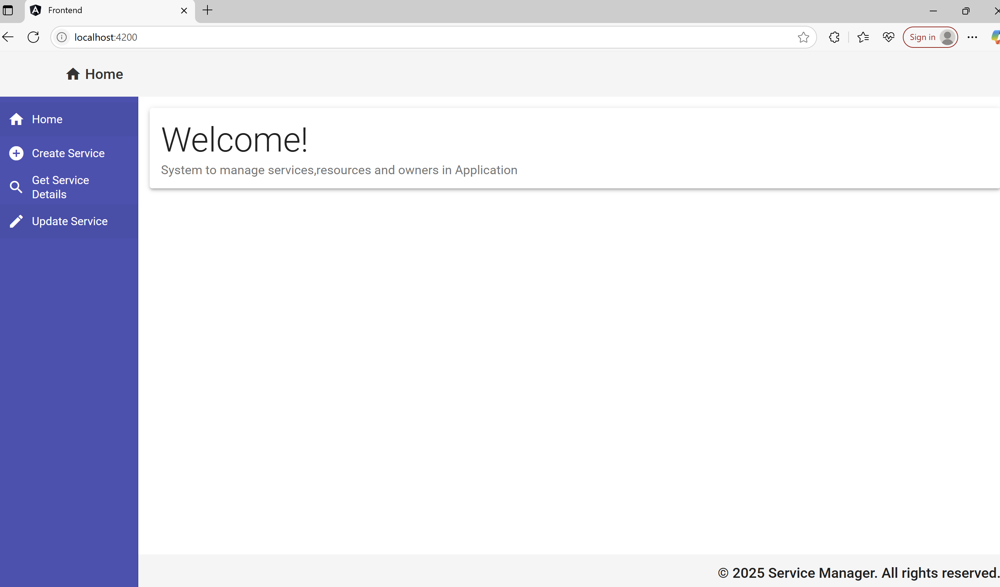

# 🛠️ Service Management Application

A Spring Boot RESTful backend combined with an Angular frontend to manage hierarchical service data—where each service contains resources, and each resource has owners. Built for clean CRUD operations and live data interaction.

---

## 🧩 Features

- ✅ Create, Read, Update operations for:
    - **Services**
    - **Resources** nested within services
    - **Owners** nested within resources
- 🧪 Custom exception handling 
- 🌐 Integrated with Angular  UI
- 🐳 Docker + Docker Compose support
- 🔄 GitHub Actions CI/CD pipeline
-    LRU cache  

---

## 📦 Tech Stack

| Layer        | Technology                    |
|--------------|-------------------------------|
| Backend      | Spring Boot 3.x               |
| Database     | MongoDb                       |
| Frontend     | Angular 17 + Angular Material |
| Build Tool   | Maven                         |
| CI/CD        | GitHub Actions                |
| Container    | Docker, Docker Compose        |

---

## 🚀 Getting Started

### 🔧 Prerequisites

- Java 17+
- Maven 3.x
- Node.js + Angular CLI
- Docker & Docker Compose

### 🐳 How to start Application in local environment

```bash
-git clone https://github.com/SakshiMahajan899/service-resource-owner-app.git
-cd service-resource-owner-app
-docker-compose up
-Application id up and running at localhost://4200
```


